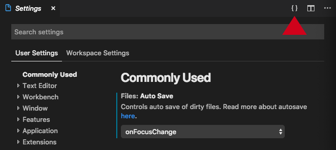
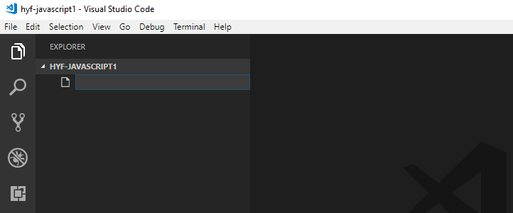
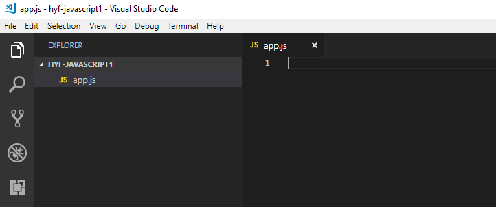
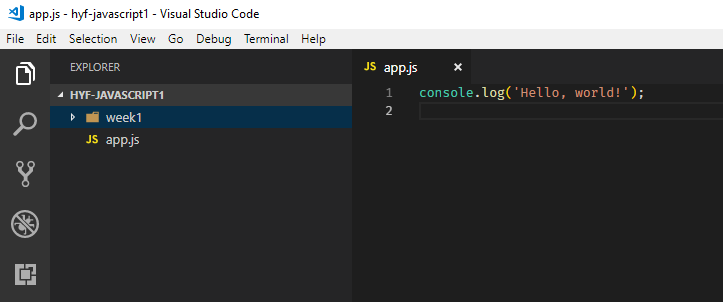
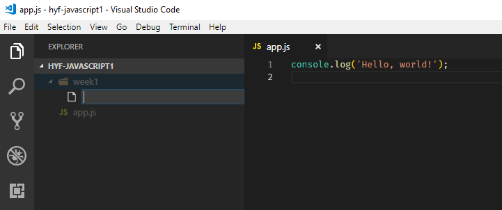

# VSCode Tips

## Installation

Download and install the appropriate version of VSCode for your operating system from the [VSCode web site](https://code.visualstudio.com/).

## Some useful extensions

VSCode can be extended with _extensions_. There are three that we recommend you install from day 1.

1. **Code Spell Checker**. We fully understand that you guys sometimes have difficulty with the correct English spelling when choosing names for variables and functions in your JavaScript programs. That is nothing to be ashamed of, but why not get some help from a handy extension?

2. **ESLint**. This extension can check your JavaScript code for obvious errors, such as undefined variables, unused variables, etc.

3. **Prettier - Code formatter**. Prettier is an code formatter that enforces a consistent style by parsing your code and re-printing it with its own rules that take the maximum line length into account, wrapping code when necessary.

   > If you have any other code formatter extensions installed, e.g., **Beautify**, be sure to remove them as they may conflict with **Prettier**.
   
4. **open in browser**. This extension is handy during the HYF JavaScript lessons. It allows you to quickly open an HTML file in the browser directly from VSCode.

5. **Live Server**. Launch a development local Server with live reload feature for static & dynamic pages.

6) **Bracket Pair Colorizer**. An extension for colorizing matching brackets.

### Installation instructions

1. Start up VSCode.

2. Press the button in the area in the left margin (called the **Activity Bar**), as shown below:

   

3. In the input field in the upper left corner, type `code spell checker` as pictured here:

   

4. Press the green `install` button of **Code Spellchecker**.

5. Install the remaining extensions by repeating steps 3 and 4, by typing the names of the extensions:

   - ESLint
   - Prettier - Code formatter
   - open in browser
   - Live Server
   - Bracket Pair Colorizer

6. When the final extension has finished installing you will notice that the green `install` button changes to a blue `reload` button. Press this button to reload VSCode and activate the newly installed extensions.
7. You now need to install a global Node package to support ESLint. Open a terminal window in VSCode by selecting **View**, **Integrated Terminal** from the menu bar.
8. A terminal window opens in the lower half of the VSCode window. In this window, type the command below (on Linux and MacOS systems you may need to prefix this command with `sudo`, e.g. `sudo npm ...`):

   ```
   npm install -g eslint-cli
   ```

## Customise VSCode Settings

We recommend that you apply a couple of changes to the default settings of VSCode to help you create well-formatted JavaScript code. Follow these steps:

1. Press the cog-wheel icon in the lower-left corner of the VSCode screen, as indicated here:

   

   > If you see a blue encircled number, e.g. 1, on this button this means that you have an outstanding VSCode update awaiting to be installed. VSCode currently has a monthly update cycle. It is best to install updates at your earliest convenience.

2. From the menu, select **Settings**.

3. From the settings panel, with the **User Settings** tab highlighted, click on the `{ }` button, as indicated by the red triangle in the figure below.

   

4. From the resulting menu, select **Open settings.json**.

5. Copy the content shown below and paste it over (i.e. replace) the existing content in the `USER SETTINGS` panel in the right-hand half of the screen.

   ```json
   /// Place your settings in this file to overwrite the default settings
   {
     "editor.detectIndentation": false,
     "editor.formatOnSave": true,
     "editor.minimap.enabled": false,
     "editor.renderIndentGuides": true,
     "editor.tabSize": 2,
     "editor.codeActionsOnSave": {
       "source.fixAll": true
     },
     "eslint.autoFixOnSave": true,
     "files.autoSave": "onFocusChange",
     "prettier.printWidth": 100,
     "prettier.singleQuote": true,
     "prettier.trailingComma": "all"
   }
   ```

6. Close the Settings tabs.

## Configuring the Default Shell (Windows users only)

By default, a VSCode installation on Window uses **PowerShell** for the Integrated Terminal. To change this to **Git Bash**, follow these steps:

1. Press the key combination **Ctrl-Shift-p** to open the VSCode Command Pallette.
2. Type the words: `select default`
3. From the drop-down menu, select **Terminal: Select Default Shell**
4. A new drop-down menu will appear. From this menu, select **Git Bash**.

## Using VSCode for your homework

You’ll get the most out of VSCode if you organise your work in folders, say a folder for each week in the JavaScript module.

(Later in the course you will be “cloning” Git repositories into local folders as the basis for your homework or projects.)

To start work with VSCode in particular folder, start VSCode and open the relevant folder: from the menu, select **File**, **Open Folder**. VSCode will now open this folder to be your "project folder", until you close VSCode or open another folder.

> Make it a habit in VSCode to always open the **folder** that contains the project you are working on, rather than individual files in that folder.

In the figure below the folder named `JavaScript2` was opened in VSCode. The directory tree for that folder in shown in the **Explorer** panel. The folder name `JAVASCRIPT2` is displayed in uppercase in the title bar of the directory tree panel.


## Creating your JavaScript file

You are now ready to start adding your first JavaScript file.

1. Open the folder where you will keep your working files, for instance `hyf-javascript1`.
2. Right-click in an empty space in the `EXPLORER` window and select **New File** from the context menu. You will see the following:

   

3. Type a file name in the edit box, e.g. `app.js` and press **Enter**. This will add a file `apps.js` to your working folder and open an editor tab for the newly created file.

   

5) Start typing your JavaScript code in the new file.

   

6) You can also create subfolders in `EXPLORER` panel. Right-click in an empty space in the `EXPLORER` window and select **New Folder** from the context menu, for instance `week1`.

   

7) To create a new file in the subfolder, right-click on the subfolder and type a file name in the input box.

   

8) Be on the watch out for coloured wavy underlines in your code. These are warnings from either ESLint or the Spell Checker that something might be wrong. If you see such wavy underlines, hover your mouse pointer over the underlined text and a tooltip will appear that explains what might be wrong.
9) You can also open the "problem" panel by selecting **View**, **Problems** from the menu to see any problems identified.
10) Pay attention also to the lower left part of the VSCode window, i.e. the status bar. It gives an indication of the number of errors and warnings issued. In the picture below there are zero errors, 7 warnings (usually from ESLint) and 14 informational messages (usually from the spell checker).

    

## Some useful short-cut commands

In the previous section we frequently referred you to the menu bar to select commands. As you get more proficient with VSCode you may want to inspect these menus a little closer and take note of the short-cut commands listed in their right margin. For example, the short-cut command for **File**, **New** is listed as Ctrl+N (press `Ctrl` and `N` keys simultaneously) on a Windows or Linux PC and ⌘N on a Mac.

Here are some short-cut commands that you will use many times a day and that we recommend you familiarise yourself with from day 1:

| Operation                                                        | Windows     | Mac | Linux        |
| ---------------------------------------------------------------- | ----------- | --- | ------------ |
| **Format Document** (make it pretty)                             | Shift‑Alt‑F | ⇧⌥F | Ctrl‑Shift‑I |
| **Search** (Find)                                                | Ctrl+F      | ⌘F  | Ctrl+F       |
| **Replace** (Find and replace)                                   | Ctrl+H      | ⌥⌘F | Ctrl+H       |
| **Rename Symbol** (change all names in file to a different name) | F2          | F2  | F2           |
| Open an **Integrated Terminal** window in VSCode                 | Ctrl+'      | ⌃\` | Ctrl+'       |

- **Format Document**. This command reformats your JavaScript file in a generally accepted standard format, using proper indenting, proper use of spaces, placing of curly braces and more. A neatly formatted document helps you to better understand your own code and your teachers, mentors and fellow students will love your for it too when they review your work.

  _With VSCode at your finger tips there is no longer any excuse for submitting poorly formatted homework!_

- **Search**. Search for specified text.
- **Replace**. Replace specified text by some other text.

  In the figure below the **Replace** pop-up window is shown. The **Search** pop-up is similar, but with one input field only.

  

  - The `Aa` button activates the **Match Case** option.
  - The `Ab|` button matches **Whole Words Only**.
  - The `.*` button allow you to search using _regular expressions_, which you may encounter in later modules as an advanced JavaScript programming topic.
  - The `c-b` button next to the second input field replaces the next occurrence of the matched text.
  - The `ab-ac` button replaces **all** occurrences of the matched text.
  - The left and right arrows move the cursor to the previous and next match.
  - To get rid of the pop-up press `Esc` or press the `x` button.

- **Rename Symbol**. This command renames all occurrences of a JavaScript variable or function name. To do so, move the text cursor to the variable or function name and press F2. A small pop-up window will appear in which you can type a new name. Press Enter to finalise the change or Esc to cancel it.

- **Open an Integrated Terminal window**. We already covered this when we mentioned the **View**, **Integrated Terminal** menu command.

## Running and debugging your code with the VSCode Node debugger

If your JavaScript program is contained in a single file the easiest way to run and examine your code is the start straight in VSCode.

1. Press the F5 function key to start the VSCode debugger.

2. You will prompted to select an environment. Choose `Node.js` as show below.

   

This starts your program in the VSCode debugger.

### Placing break points and inspecting variables

This is covered in class.

### Further information

Please note that VSCode is actively being developed. At present there is a monthly release cycle, so don't be surprised when you are prompted once a month to update to the latest version. We advise you to update when prompted (naturally, not when you are in the middle something that you don't want interrupted).

You can find detailed information about VSCode at the [VSCode web site](https://code.visualstudio.com/docs).
